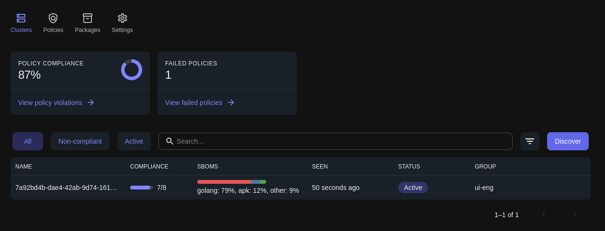
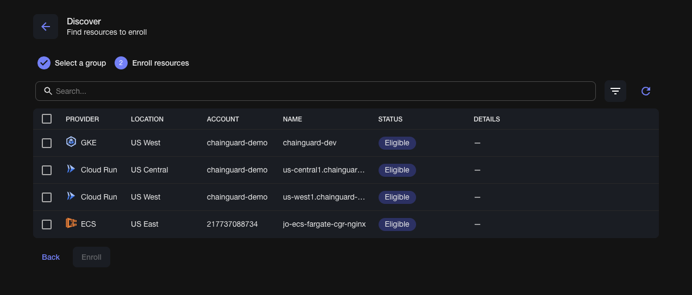

> **Chainguard Enforce Discovery is in Beta Preview. You can request access to the product selecting Chainguard Enforce on the [inquiry form](https://www.chainguard.dev/contact?utm_source=docs).**

Chainguard Enforce Discovery enables customers to discover various containerized workloads across their organization, providing greater visibility into their security posture. This can help organizations ensure that Chainguard Enforce (and any policies they have configured) are being evaluated against all of the clusters across their organization.

This new Discovery capability leverages Chainguard’s agentless technology to connect to GKE and EKS clusters, and now expands Chainguard’s agentless support to support Google Cloud Run, AWS ECS, and AWS AppRunner.


## Prerequisites

Before trying out Chainguard Enforce Discovery, ensure that you have the following.

* Terraform, an infrastructure as code tool that allows you to manage cloud infrastructure declaratively, installed on your local machine. Follow the [official Terraform Installation instructions ](https://developer.hashicorp.com/terraform/tutorials/aws-get-started/install-cli) to set this up.
* `chainctl` installed on your local machine. For this, check out our guide on [How To Install `chainctl`](https://edu.chainguard.dev/chainguard/chainguard-enforce/chainctl-docs/how-to-install-chainctl/).
* An account with one or more cloud providers. Enforce Discovery currently works with GCP and AWS.
* A Chainguard Enforce Cloud Account Association set up for each of your cloud accounts. This allows the Chainguard Enforce platform to access cloud resources on your behalf. To configure this, follow our guide on [How to Set Up Chainguard Enforce Cloud Account Associations](https://edu.chainguard.dev/chainguard/chainguard-enforce/chainguard-enforce-kubernetes/cloud-account-associations/).


## Step 1 — Configure or Update Impersonation

Chainguard Enforce Discovery impersonates a new `chainguard-discovery` role and service account within your GCP project or AWS account. If you haven't set up your cloud account associations recently, then you will likely need to update them to include the new roles. You can do this by  running the following commands against the Terraform state created when you first set up the association.

```sh
terraform init -upgrade
terraform apply
```

For AWS impersonation, there is also a new module you must instantiate for each region you are running services. If you need to set this up, add the following lines to your Terraform configuration file.

```
module "aws-auditlogs" {
  # Note the // is semantic
  source = "chainguard-dev/chainguard-account-association/aws//auditlogs"
}
```

With that, you can move on to testing out Discovery.


## Step 2 — Using Chainguard Enforce Discovery

Chainguard Enforce Discovery exposes an API that will return metadata about clusters it encounters, including the cloud provider hosting the cluster, the account associated with the cluster, its location, and its name. It will also return a column labeled `ELIGIBILITY` with each cluster being sorted into one of four categories.

* `unsupported`: we do not currently support this type of cluster.
* `needs work`: we could support this cluster, but you need to take some steps before it is eligible. If any of your resources fall within this category, `chainctl` will outline what you need to change in order to make them eligible.
* `eligible`: this cluster is ready to enroll with Chainguard Enforce.
* `enrolled`: this cluster is already enrolled in Enforce.

In order for a cluster to be eligible, it must either have a public endpoint with no access control or, if it does have access control, it must give Chainguard access. If a cluster isn't supported, it's typically because of locked down control planes; for example, bastion or control plane authorized networks on GKE.

There are currently three options for how you can use Discovery: using the Chainguard Enforce Console, the `chainctl cluster discover` command, or the Chainguard Terraform provider.


### Option 1 — Chainguard Enforce Console

You can discover workloads running in your various cloud accounts through the Chainguard Enforce Console. After logging into the Console, there will be a **Discover** button at the top-right of the list of clusters.



Clicking the button will take you to the Discover UI, which contains a list of Chainguard Enforce groups that are associated with one or more cloud accounts, as well as the providers available for those groups.

If you click on a group, the Chainguard Enforce Console will discover all the resources associated with that group and will list them on the resulting page. This example shows a group associated with GKE, Cloud Run, and ECS resources.



From there, you can select the resources in which you want Discovery enabled, and then click the **Enroll** button to enroll them into Chainguard Enforce. Following that, you'll be taken back to the Clusters list page. From there, you can begin using Enforce to view the images and packages running on your newly-enrolled cluster or apply security policies to make sure cloud applications are up-to-date, just as you would with any other cluster you've enrolled into Chainguard Enforce.


### Option 2 — `chainctl cluster discover`

The `discover` subcommand requires you to specify which cloud provider you want to perform Discovery on. As of this writing, Chainguard Enforce Discovery supports the `gke`, `eks`, `ecs`, `cloudrun`, and `apprunner` options. In order to use Discovery, the GCP services require that you have set up GCP account associations. Likewise, the AWS services require that you have set up AWS impersonation.

You can also include the `--group` option followed by the name of the IAM group under which you'd like to perform Discovery. Any clusters you enroll will be linked to this IAM group. If you don't specify a group, then you will be prompted to choose one.

For example, you might run the following command to discover your GKE resources.

```sh
chainctl cluster discover --provider gke
```
```
  PROVIDER |       ACCOUNT        |  LOCATION  |     NAME      | ELIGIBILITY | DETAILS
-----------+----------------------+------------+---------------+-------------+----------
       GKE | discovery-edu-375902 | US_CENTRAL | gcp-cluster-1 |	eligible |
       GKE | discovery-edu-375902 | US_CENTRAL | gcp-cluster-2 |	eligible |

Would you like to enroll 2 eligible clusters?

Do you want to continue? [Y,n]:
```

As this example shows, `chainctl` will prompt you to confirm whether you want to enroll all of the eligible resources. If you press `ENTER`, then all of the eligible clusters will be enrolled with Chainguard Enforce.

Be aware that the `discover` subcommand doesn’t currently have a good cleanup mechanism, meaning it doesn't provide a reliable method for deleting non-Kubernetes clusters.


### Option 3 — Chainguard Terraform Provider

The chainguard Terraform provider exposes a new “data source” to drive Chainguard Discovery. You can have Terraform read and use this data by adding the following block to your configuration.

```
data "chainguard_cluster_discovery" "gotta-catch-em-all" {
  id = local.group_id
  providers = [
	"APP_RUNNER",
	"CLOUD_RUN",
	"ECS",
	"EKS",
	"GKE",
  ]
  profiles = ["enforcer"]
}
```

This will return the Discovery results, which can be piped into other resources (possibly as an output). The main use case for this data, though, will be to feed it into a `chainguard_cluster` resource:

```
resource "chainguard_cluster" "discovery" {
  for_each = { for result in data.chainguard_cluster_discovery.gotta-catch-em-all.results : result.name => result }

  parent_id = local.group_id
  name = "${lower(each.value.provider)} ${each.key}"

  profiles = ["enforcer"]
  affinity = each.value.location
  managed {
    provider = lower(each.value.provider)
    info {
      server = each.value.state.0.server
      certificate_authority_data = each.value.state.0.certificate_authority_data
    }
  }
}
```

When you `terraform apply` this configuration, it will output the set of clusters it will enroll.

To clean things up, you can comment out the resources and re-apply. You can alternatively run the `terraform destroy` command, but beware that this will destroy every remote object managed by your Terraform configuration.


## Authorizing Enforce Access to GKE Cluster

One instance of where a GKE cluster might be discovered and marked as `needs work` is when cluster access is only provided to an authorized network. 

```
  PROVIDER |       ACCOUNT        |  LOCATION  |     NAME      | ELIGIBILITY | DETAILS
-----------+----------------------+------------+---------------+-------------+----------
       GKE | discovery-edu-375902 |    US_WEST | gke-cluster   |  needs work |
```

To allow Enforce to enroll the discovered cluster, follow these instructions for your given provider. Be aware that this will only work if the cluster is configured with a public access endpoint that is access controlled.

* GKE: [Add an authorized network to an existing cluster](https://cloud.google.com/kubernetes-engine/docs/how-to/authorized-networks#add)
* EKS: [Amazon EKS cluster endpoint access control](https://docs.aws.amazon.com/eks/latest/userguide/cluster-endpoint.html)

The following is a list of CIDR blocks that Enforce will access from.



Note that this list will grow over time.


## Learn More

After enrolling your clusters using Chainguard Enforce Discovery, you can use the `chainctl` CLI or the [Enforce web console](https://console.enforce.dev) to interact with them just like any other cluster you have installed Enforce onto.
