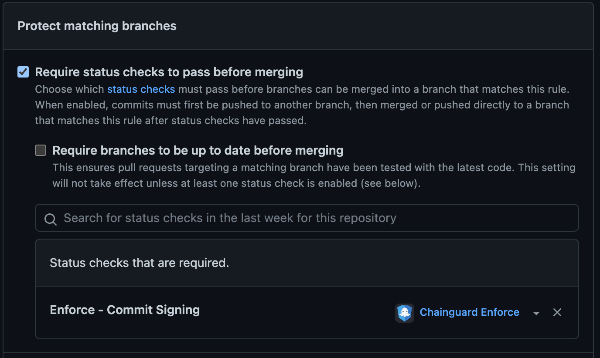

Chainguard Enforce for Git currently supports Gitsign signatures from the public Sigstore instance.

**Note**: This app is currently in alpha and available for GitHub, so permissions may change, and features may be added or removed without notice during this time.

## Installation

To get started, you'll need to [install the app on GitHub](../install-enforce-github/) to either your personal account or your organization.

Additionally, you will need to [install and configure Gitsign](https://docs.sigstore.dev/gitsign/installation) on your development machine. You may also wish to consult the [Gitsign repo README](https://github.com/sigstore/gitsign/blob/main/README.md).

Once this is done, the Enforce for Git app will automatically respond to new pull requests events.


Note that the app will only respond to existing pull requests if there is new commit activity.

## Configure the verification policy

To configure a policy to define what identities are or are not allowed to sign commits, add a file called `.chainguard/source.yaml` to the root of your repository:

```yaml
spec:
  authorities:
    - keyless:
        identities:
          - issuer: https://accounts.google.com
          - subjectRegExp: .*@chainguard.dev$
    - key:
        kms: https://github.com/web-flow.gpg
```


This config file corresponds to a [Sigstore Authority](https://pkg.go.dev/github.com/sigstore/policy-controller/pkg/apis/policy/v1beta1#Authority) policy. Currently, the following fields are respected:

- `keyless`
  - `identities`
      - `issuer`
      - `issuerRegExp`
      - `subject`
      - `subjectRegExp`
- `key`
  - `kms` (`https` only, restricted to `github.com`, `gitlab.com`)

Only the public `sigstore.dev` instance is used at this time. 

## Trusting signed commits

Commits made by the GitHub API or UI are signed with a [special key managed by GitHub](https://docs.github.com/en/authentication/managing-commit-signature-verification/about-commit-signature-verification).
To configure Enforce to trust this key, add it as an authority to your
verification policy.

```yaml
- key:
    kms: https://github.com/web-flow.gpg
```

You can add keys for other users by adding `https://github.com/<user>.gpg`.

**Note**: Commits signed with GitHub GPG are **not** present on Rekor by default. If the key is revoked or otherwise changed, Enforce will no longer recognize the signatures as valid.

## Require Enforce for submission

To require the Enforce for Git app to succeed before pull request submission, enable the **[Require status checks before merging](https://docs.github.com/en/repositories/configuring-branches-and-merges-in-your-repository/defining-the-mergeability-of-pull-requests/about-protected-branches#require-status-checks-before-merging)** feature on the desired branch for the `Enforce - Commit Signing` check.



You can find this page by navigating to a given repository's **Settings** and then clicking on **Branches** (under **Code and automation**).

## Enable or disable repositories

If you wish to add or remove repositories that Enforce for GitHub responds to in an organization, you can do so via the installation settings page. This page can be found by:

- From a repository page: **Settings** > **Integrations** > **GitHub apps** > **Installed GitHub Apps** > **Chainguard Enforce** > **Configure**
- From an organization page: **Settings** > **Integrations** > **Applications** > **Installed GitHub Apps** > **Chainguard Enforce** > **Configure**

From here, the **Repository Access** configuration can be used to add or remove repos from the app installation.


This page may also be used to completely uninstall the Enforce app from your organization.

Note that if you want to add a new organization or repo, return to the [Installation section](#installation) for relevant instructions.

## Roadmap

Chainguard Enforce for Git has a number of features on its roadmap.

- Bring your own Sigstore instance
- Policies — define policies for what identities can or must sign your code.
- Supply chain security insights

And there's more to come!

Want to learn more about Chainguard Enforce? Have a feature request? Let us know at [https://www.chainguard.dev/contact](https://www.chainguard.dev/contact).