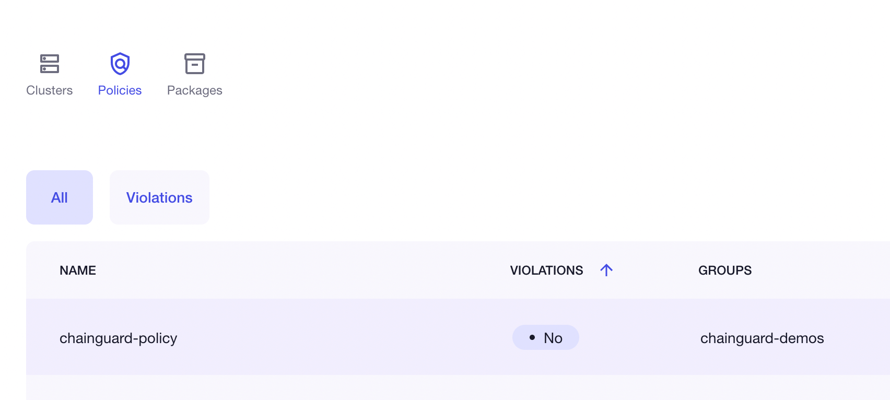
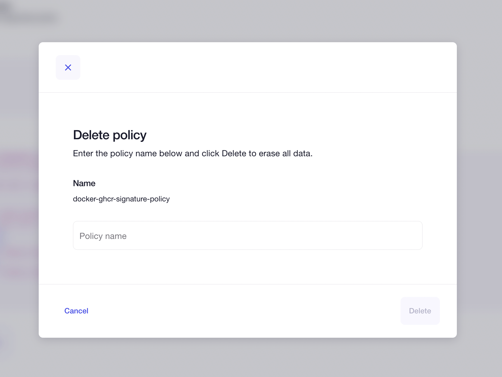

Security policies in Chainguard Enforce ensure that our development teams are deploying containers within set policies. 

We can associate a policy YAML file with a given group in order to achieve our security goals. This guide will go through how to set up policies on the Chainguard Enforce user interface available to you via [console.enforce.dev](https://console.enforce.dev). You must already have an account with Chainguard to follow this guide. You can request access for **Chainguard Enforce for Kubernetes** on the [inquiry form](https://www.chainguard.dev/get-demo?utm_source=docs).

To review sample policies that you may want to leverage, please check out our page on [Chainguard Enforce Policy Examples](chainguard-enforce-policy-examples). If you would like to use the CLI to work with policies, review our [`chainctl` policy docs](https://edu.chainguard.dev/chainguard/chainguard-enforce/chainctl-docs/chainctl_policies_apply/).

## Access the Chainguard Enforce Console

To begin, you will need to access your Chainguard Enforce Console. This is available on the web to you at [console.enforce.dev](https://console.enforce.dev). You will need to authenticate your user. Once you are logged in and authenticated, the Chainguard Enforce Console landing page will be displayed. 

At the top of the page will be three icons you can click on: **Clusters**, **Policies**, and **Packages**. Click on **Policies** to pull up the policies you have available on Chainguard Enforce.

## Inspect any existing policies

If you were invited to a group, you may already have policies available. From the Policy landing page, you can review any existing policies and any existing violations of those policies. 

These are displayed in a table by the policy's **Name**, **Violations** and **Groups**, similar to the following screenshot.

If your table indicates that there are current violations, you can click on the **Violations** button to learn more about these violations.

## Initialize a new policy

Let's step through creating a new policy. Click on the **Create policy** button above the policy table. 

The **Create policy** button will open a drop-down menu with two options:

* **Custom** — to start with a blank policy
* **Signature** — to start with a policy that requires that images have a signature. 

With either option you won't start from scratch but have some of the boilerplate text of the YAML file already filled in so you can work on your policy.

## Write and publish a policy

Whether you choose to begin with the **Custom** or **Signature** policy, a new sidebar will be displayed that has fields to choose the **Group**, and write a **Description** for your new policy. You can also edit the YAML file itself. 

In the **Signature** policy, you'll have an additional field for the policy's **Name**, a field for **Image**, and an option to add more images. 

Fill in the fields for this policy until you are satisfied. In the policy below, we are requiring signatures for all Docker and GitHub container images. We have associated it with the `chainguard-demos` group. 

Once you are satisfied with the new policy, you can click the **Publish** button towards the bottom of the form.

This new policy will now appear on your policy table within the Chainguard Enforce Console.

## Edit policies

To modify an existing policy, click on the relevant policy within your Chainguard Enforce Console table. This will take you to a view allowing you to edit or delete the policy. 

To edit a policy, click  on the **Edit** button will allow you to make modifications to the description or YAML file of the policy. When you are satisfied with the changes you have made, you can click on the **Publish** button once again.

## Delete policies

If you would like to delete a policy, click on the policy you wish to delete within your Chainguard Enforce Console table. From there, click on the **Delete** button. 

You'll now have the option to delete a published policy. You will need to type in the name of the policy in order to delete it. Once you have written the name of the policy in the field, click the **Delete** button to delete the policy and return to your **Policies** page. 